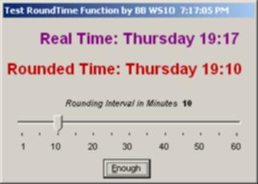



## RoundedTime

### Description

Generate string containing current time rounded to the nearest N minutes (eg, set it for 5-minute intervals and 3:15 to 3:20 PM are displayed as 15:15). Could be used to fire events every N minutes, or whatever.
 
### More Info
 
Current time (from Timer control, or VB Now() function, etc)

String formatted as HH:MM (eg, 13:20)

             |
---                |---
**Submitted On**   |2001-05-24 19:12:22
**By**             |[Brian Battles WS1O](https://github.com/Planet-Source-Code/PSCIndex/blob/master/ByAuthor/brian-battles-ws1o.md)
**Level**          |Beginner
**User Rating**    |5.0 (15 globes from 3 users)
**Compatibility**  |VB 6\.0
**Category**       |[Math/ Dates](https://github.com/Planet-Source-Code/PSCIndex/blob/master/ByCategory/math-dates__1-37.md)
**World**          |[Visual Basic](https://github.com/Planet-Source-Code/PSCIndex/blob/master/ByWorld/visual-basic.md)
**Archive File**   |[RoundedTim200315242001\.zip](https://github.com/Planet-Source-Code/brian-battles-ws1o-roundedtime__1-23420/archive/master.zip)

